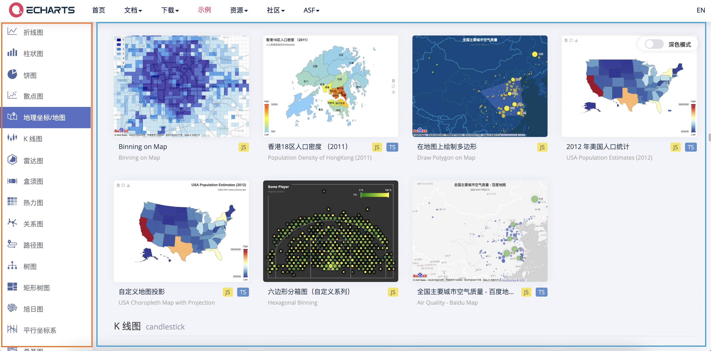
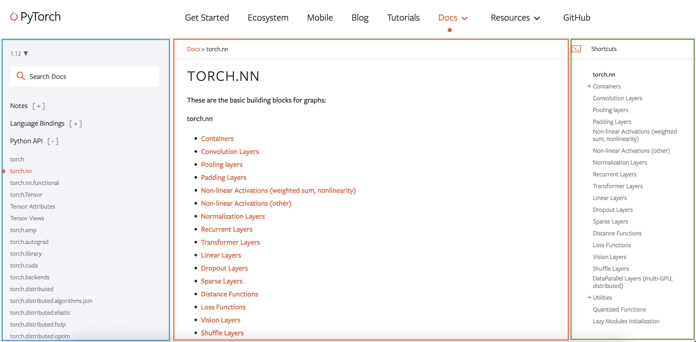

# 前言
很多网页的整体布局呈现为 “两栏” 或者 “三栏”，比如下图中 echarts 的布局就是最典型的**左右两栏**：



此外，另一种常用布局就是 **“左-中-右” 三栏布局**，比如下图中 pytorch 的官方文档：



当然，还有很多网页都采用的这种布局方式，这里我也就不一一举例。回归到问题本质，那么该如何实现这种布局？又或者说有哪些方法可以满足我们的布局需求呢？

因为两栏布局比较简单，故本文将主要围绕三栏布局，思想大同小异，读者也可以灵活变通，从而解决两栏布局的问题。

这里我把本文的核心问题再提出来详细描述一番，以免有读者没有完全理解，即：**将网页分为左中右三栏布局，左右部分定宽，中间部分宽度自适应**。

# 常用方法及原理

基于我自己开发的经验并借鉴其他的参考资料，本文根据布局的方法分为四种主体类型，其中基于 float 布局的方式下还包括经典的**圣杯布局**和**双飞翼布局**。如下所示：

> 1. **基于 absolute 定位** 
> 2. **基于 float 布局**
>> + *圣杯布局*
>> + *双飞翼布局*
> 3. **基于 flex 布局**
> 4. **基于 grid 布局**

首先我们先定义三个元素，即：`left`、`main`、`right` 三个部分。其 html 形式如下所示，后续也将不再重复赘述这一部分。
```html
<div class='left'>Left</div>
<div class='main'>Main</div>
<div class='right'>Right</div>
```
## 基于 absolute 定位
`absolute` 定位提供了 `top`、`left`、`bottom`、`right` 等定位属性，并且绝对定位的元素脱离文档流，相对于最近的已经定位的祖先元素进行定位。因此，该方法的思路如下：
> 1. 分别将左、右两个部分基于 absolute 的相关属性定位到左右两边。
> 2. 中间的部分直接占据宽度的 100%，并基于 `margin` 留出 left 和 right 部分的宽度。

代码如下：

```css
.container { /*容器*/
    position: relative;
}

.left, .right, .main{
    height: 100px;
    font-weight: bold;
}
.left{
    position: absolute;  /* 关键代码 */
    top: 0;  /* 关键代码 */
    left: 0;  /* 关键代码 */
    width: 100px;
    background: pink;
}
.right{
    position: absolute;  /* 关键代码 */
    top: 0;  /* 关键代码 */
    right: 0;  /* 关键代码 */
    width: 100px;
    background: pink;
}
.main{
    margin: 0 105px;  /* 关键代码 */
    background: lightgreen;
}
```

```html
<div class='container'>
    <div class='left'>Left</div>
    <div class='right'>Right</div>
    <div class='main'>Main</div>
</div>
```

<style>
.container { /*容器*/
    position: relative;
}

.left, .right, .main{
    height: 100px;
    font-weight: bold;
}
.left{
    position: absolute;  /* 关键代码 */
    top: 0;  /* 关键代码 */
    left: 0;  /* 关键代码 */
    width: 100px;
    background: pink;
}
.right{
    position: absolute;  /* 关键代码 */
    top: 0;  /* 关键代码 */
    right: 0;  /* 关键代码 */
    width: 100px;
    background: orange;
}
.main{
    margin: 0 100px;  /* 关键代码 */
    background: lightgreen;
}
</style>

<div class='container'>
<div class='left'>Left</div>
<div class='right'>Right</div>
<div class='main'>Main</div>
</div>
<br>

上面就是基于 absolute 定位实现的三栏布局效果图。然而这种方法一旦出现**中间栏含有最小宽度的限制，且当浏览器宽度小到一定程度的时候，就会发生层重叠的情况**。因此，该方法并不是最优选择 ❌，且不够优雅！

## 基于 float 布局

`float` 布局是一个众所周知被常用于三栏布局的方法。我们可以分别将左部分设置为 `float: left`，将右部分设置为 `float: right`，最后中间部分自适应即可。

然而这种方法存在一个问题：由于中间部分的自适应是依赖于左右部分的，因此在 html 的节点中，一定是要先加载 `left` 和 `right`，才能再加载 `main`。如果顺序出现问题，则 `main` 不能正确的获取位置。然而，很多网页中，中间部分的重要程度往往更大，需要最先加载，那么这种方法就无法满足需求了。

为了解决上述问题，实现**中间部分先加载**，我提供了两种经典方法：**圣杯布局**和**双飞翼布局**。

### 圣杯布局 ✅
圣杯布局是一个经典的基于 float 的布局方法，在很多页面中被使用到，包括下一小节的双飞翼布局也是在圣杯布局上进行的优化。因此，我也将详细介绍圣杯布局的原理。

首先，我们还是设置三个部分：`left`、`main`、`right`，并将其设置为 `float: left`，代码如下：

```css
.container {
    position: relative;
}
.main, .left, .right {
    float: left;  /* 关键代码 */
    height: 100px;
    font-weight: bold;
}
.main {
    width: 100%;
    background: lightgreen;
}
.left {
    width: 100px;
    background: pink;
}
.right {
    width: 100px;
    background: orange;
}
```

```html
<div class='container'>
    <div class='main'>Main</div>
    <div class='left'>Left</div>
    <div class='right'>Right</div>
</div>
```

<style>
.container1 {
    position: relative;
}
.container2 {
    position: relative;
    padding: 0 105px;
}
.main1, .left1, .right1 {
    float: left;
    height: 100px;
    font-weight: bold;
}
.main1 {
    width: 100%;
    background: lightgreen;
}
.left1 {
    width: 100px;
    background: pink;
}
.right1 {
    width: 100px;
    background: orange;
}
.clear::after { /* 清除浮动 */
    content: '';
    display: block;
    clear: both;
}
</style>
<div class='container1 clear'>
    <div class='main1'>Main</div>
    <div class='left1'>Left</div>
    <div class='right1'>Right</div>
</div>
<br>

从上面的结果可以看出，由于 `main` 设置的 `width: 100%`，因此占据了整个页面的宽度，因此 `left` 和 `right` 的内容都因为空间不足而被迫移到了下一行。但是这里有一个重要的知识点：**虽然 `left` 和 `right` 被在视觉上被移到了下一行，实际上它们和 `main` 还是在一行中（不理解 float 的读者建议去先学习一下）**。

那么该怎么在这个基础上来实现三栏布局呢？我们可以先给 `container` 元素添加上 `padding` 效果，从而让整体预留出 `left` 和 `right` 的视觉空间。代码如下：

```css
.container {
    position: relative;
    padding: 0 105px; /* 关键代码 */
}
```
<div class='container2 clear'>
    <div class='main1'>Main</div>
    <div class='left1'>Left</div>
    <div class='right1'>Right</div>
</div>
<br>

由上图可以看出，`main` 的左右都变成了空白，为 `left` `right` 预留出了它们**理所应当在的位置空间**。后续的调整也很显而易见了：**将 `left` 和 `right` 移动到 `main` 的左右两边**。

那么如何移动呢？**使用 `relative` 定位的相关属性和负值 `margin`。**再次提醒，`main`、`left`、`right` 实际位置是在同一行中的。如果忽略了这一点，可能会不理解下面代码中的 `margin-left: -100%` 的含义。代码如下：

```css
/* 圣杯布局 */
.container {
    position: relative;
    padding: 0 100px; /* 关键代码：腾出空位 */
}
.main, .left, .right {
    float: left;
    height: 100px;
    font-weight: bold;
}
.main {
    width: 100%;
    background: lightgreen;
}
.left {
    position: relative;  /* 关键代码 */
    width: 100px;
    margin-left: -100%;  /* 关键代码：左移动 100% （main的宽度） */
    left: -100px;  /* 关键代码：距离左边线 -自身宽度，实现左移 */
    background: pink;
}
.right {
    position: relative;
    width: 100px;
    margin-left: -100px; /* 关键代码：左移动 自身宽度 */
    left: 100px; /* 关键代码：距离左边线 自身宽度，实现右移 */
    background: orange;
}
```

<style>
.container2 {
    position: relative;
    padding: 0 100px; /* 关键代码：腾出空位 */
}
.main2, .left2, .right2 {
    float: left;
    height: 100px;
    font-weight: bold;
}
.main2 {
    width: 100%;
    background: lightgreen;
}
.left2 {
    position: relative;  /* 关键代码 */
    width: 100px;
    margin-left: -100%;  /* 关键代码：左移动 100% */
    left: -100px;  /* 关键代码：距离左边线 -自身宽度，实现左移 */
    background: pink;
}
.right2 {
    position: relative;
    width: 100px;
    margin-left: -100px; /* 关键代码：左移动 自身宽度 */
    left: 100px; /* 关键代码：距离左边线 自身宽度，实现右移 */
    background: orange;
}
</style>

<div class='container2 clear'>
    <div class='main2'>Main</div>
    <div class='left2'>Left</div>
    <div class='right2'>Right</div>
</div>
<br>

此处 html 的代码和上述组织形式相同。从上图可以看出，我们已经实现了三栏布局。至此，**上述的 CSS 代码就是圣杯布局的全部内容**。

### 双飞翼布局 ✅

在上一节的开头，本文提到**双飞翼布局是对圣杯布局的优化**。其实理解了圣杯布局的逻辑会发现，很多内容存在冗余，从而导致了一定的复杂度。那么下面就来看看双飞翼布局是如何优化的。

双飞翼布局的思路就是：**首先不需要对整个 `container` 进行 `padding` 设置，取而代之的是再用一个容器 `wrapper` 包裹着 `main`，并对 `main` 进行相关设置**。代码如下：
```css
.left, .right {
        float: left;
        width: 100px;
        height: 100px;
        font-weight: bold;
    }
    .wrapper {  /* 关键代码：包裹 */
        float: left;
        width: 100%;
        height: 100px;
        background: lightgreen;
    }
    .main {
        margin: 0 100px;  /* 关键代码：只对 main 设置 margin */
        height: 100px;
        font-weight: bold;
    }
    .left {
        margin-left: -100%;  /* 关键代码 */
        background: pink;
    }
    .right {
        margin-left: -100px;  /* 关键代码 */
        background: orange;
    }
```

```html
<div class='container'>
    <div class='wrapper'>
        <div class='main'>Main</div>
    </div>
    <div class='left'>Left</div>
    <div class='right'>Right</div>
</div>
```

<style>
    .left3, .right3 {
        float: left;
        width: 100px;
        height: 100px;
        font-weight: bold;
    }
    .wrapper {
        float: left;
        width: 100%;
        height: 100px;
        background: lightgreen;
    }
    .main3 {
        margin: 0 100px;
        height: 100px;
        font-weight: bold;
    }
    .left3 {
        margin-left: -100%;
        background: pink;
    }
    .right3 {
        margin-left: -100px;
        background: orange;
    }
</style>

<div class='container clear'>
    <div class='wrapper'>
        <div class='main3'>Main</div>
    </div>
    <div class='left3'>Left</div>
    <div class='right3'>Right</div>
</div>
<br>

上图达到了三栏布局的效果。有几个比较重要的点，本文对此再做一定的解释：
> 1. 利用 `wrapper` 包裹，`wrapper` 的宽度还是占据整个页面的宽度。
> 2. 只对 `main` 设置 margin 属性，达到内容不被 `left` 和 `right` 遮盖。
> 3. `margin-left` 的负值理解，重点是**移动的参考线在哪，移动的距离多长**。

我相信，当你理解了上述三点，就能够彻底理解双飞翼布局的原理啦！

## 基于 flex 布局
之前我在一篇文章中说了一句**flex yyds**！那既然都这么说了，那么`flex` 布局也可以灵活且简洁地实现三栏布局的需求。

`flex` 弹性布局实现三栏布局十分简单，这里我也不详细赘述，直接上代码，想了解的也可以去学一学 `flex`。

```css
.container { /* 关键部分 */
    display: flex;  
    justify-content: space-between;
}
.main, .left, .right {
    height: 100px;
    font-weight: bold;
}
.left {
    width: 100px;
    background: pink;
}
.right {
    width: 100px;
    background: orange;
}
.main {
    width: 100%;
    background: lightgreen;
}
```

```html
<div class='container'>
    <div class='left'>Left</div>
    <div class='main'>Main</div>
    <div class='right'>Right</div>
</div>
```

<style>
.container4 {
    display: flex;
    justify-content: space-between;
}
.main4, .left4, .right4 {
    height: 100px;
    font-weight: bold;
}
.left4 {
    width: 100px;
    background: pink;
}
.right4 {
    width: 100px;
    background: orange;
}
.main4 {
    width: 100%;
    background: lightgreen;
}
</style>
<div class='container4'>
<div class='left4'>Left</div>
<div class='main4'>Main</div>
<div class='right4'>Right</div>
</div>
<br>

上图的效果也是满足我们的需求，并且代码量是否少。整个实现原理如下所示：
> 1. 将容器设置为 `display:flex`，盒内元素排布方式为 `space-between`。
> 2. 设置左右元素宽度，再将中间元素设置为 `width: 100%`，或者设为`flex: 1`，即可填充空白部分。

由此可见，`flex` 布局用于实现三栏布局是一个简便且优雅的方法 ✅！

## 基于 grid 布局

我之前阅读的时候看到过有一个大佬说 grid 布局是最强大的布局，这次我特地去找到了这篇文章：[《最强大的 CSS 布局 —— Grid 布局》](https://juejin.cn/post/6854573220306255880)，感兴趣的可以阅读并学习一下 grid 布局。本人觉得 grid 布局如果不考虑浏览器的兼容性问题的话，确实是一个十分优秀的选择，建议读者了解并学习。

因为 grid 布局和 flex 布局实现三栏布局都十分简单，因此这里我也直接放代码，想要学习细节的可以参考提供的学习链接。

```css
.container {
    display: grid;
    grid-template-columns: 100px auto 100px;
}
.main, .left, .right {
    height: 100px;
    font-weight: bold;
}
.left {
    background: pink;
}
.right {
    background: orange;
}
.main {
    background: lightgreen;
}
```

```html
<div class='container'>
    <div class='left'>Left</div>
    <div class='main'>Main</div>
    <div class='right'>Right</div>
</div>
```
<style>
.container5 {
    display: grid;
    grid-template-columns: 100px auto 100px;
}
.main5, .left5, .right5 {
    height: 100px;
    font-weight: bold;
}
.left5 {
    background: pink;
}
.right5 {
    background: orange;
}
.main5 {
    background: lightgreen;
}
</style>
<div class='container5'>
<div class='left5'>Left</div>
<div class='main5'>Main</div>
<div class='right5'>Right</div>
</div>
<br>

效果如上图所示，我也不多说什么，只能说**大佬没说错，grid 也是 yyds ✅！**

# 总结

以上就是所有内容啦，我总结了**四种实现三栏布局**的方法供大家参考。第一张方法使用较少，缺点也比较明显，我也是建议大家多多学习并理解后面三种方法，尤其是认真学习**圣杯布局**和**双飞翼布局**，这有助于提升你对 CSS 的理解。

---
**很感谢你能看到这里！谢谢～**

---
参考资料： (衷心感谢各参考资料提供的帮助)
+  [实现css两栏布局、右侧自适应、三栏布局中间自适应](https://juejin.cn/post/7099326366516477966#heading-18)
+  [CSS三栏布局的四种方法](https://juejin.cn/post/6844903456323403783)
+  [CSS经典三列布局—圣杯布局与双飞翼布局](https://juejin.cn/post/7118571813742837774)
+  [最强大的 CSS 布局 —— Grid 布局](https://juejin.cn/post/6854573220306255880)

